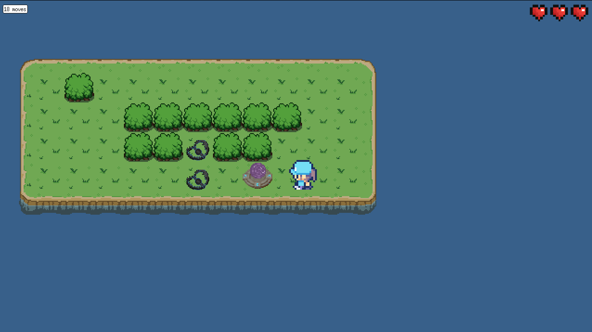
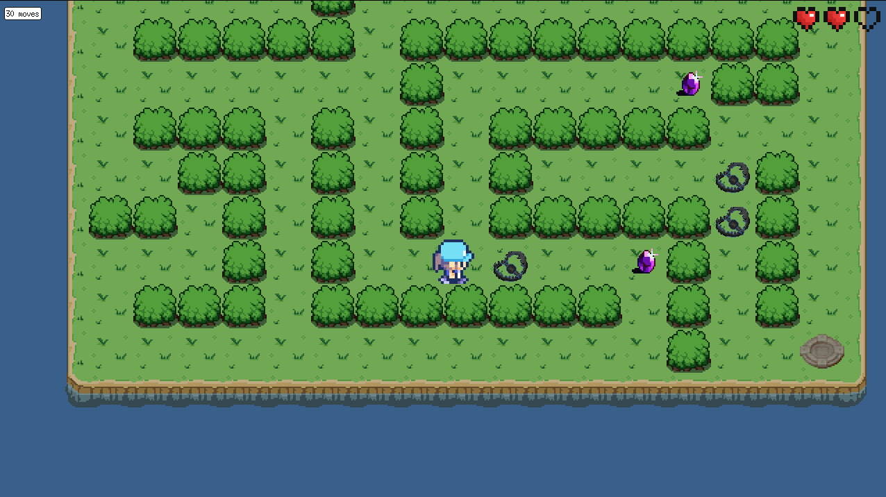
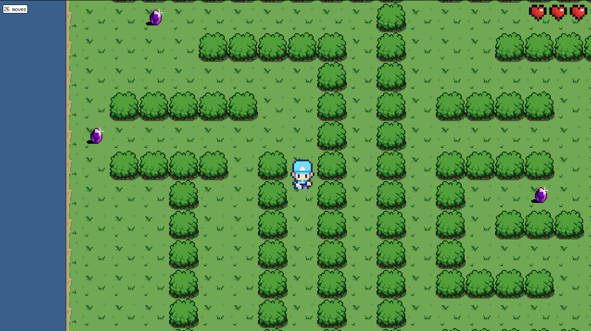

# so_long


---

## 📌 Summary
- [About](#about)
- [Features](#features)
- [Installation](#installation)
- [Utilisation](#utilisation)
- [Exemples](#exemples)
- [Directories structure](#directories-structure)
- [Author](#author)

---

<a id="about"></a>
## 📖 About

**so_long** is a project of 42 school.
It's a 2D game, where the goal is collect collectibles and reach the exit.

---

<a id="features"></a>
## ✨ Features

✅ Take and display a map given as argument `.ber`  
✅ Player movements (WASD or directional arrows)  
✅ Collisions management  
✅ Collection of objects  
✅ Exit detection  
✅ Health system with traps  
✅ Animated sprites

---

<a id="installation"></a>
## ⚙️ Installation

**1. Clone the repository**
```bash
git clone git@github.com:qxxel/so_long.git;
cd so_long
```

**2. Compile the project**
```bash
make
```

---

<a id="utilisation"></a>
## 🕹️ Utilisation

**1. Build your own map `.ber` or use those provited**

A valid map is rectangular and closed, with, at least, a path the go through every collectibles and the exit from the spawn.

The file il build like this:
- 1 = `wall`
- 0 = `floor`
- P = `player spawn`
- C = `collectible`
- E = `exit`
- T = `trap`

Exemple of a map `.ber`:
```
11111111
1P0000C1
1T111101
1C0000E1
11111111
```

**2. Lauch the program**

```bash
./so_long map.ber
```

---

<a id="exemples"></a>
## 📸 Exemples

**Comming soon...**

  
  
  

<a id="directories-structure"></a>
## 📂 Directories structure

```plaintext
📂 so_long
 ┣ 📂 assets            → sprites
 ┣ 📂 includes          → headers files (.h)
 ┣ 📂 libft             → my own C library
 ┣ 📂 maps              → test maps
 ┣ 📂 minilibx-linux    → linux graphical library (42 ressource)
 ┣ 📂 srcs              → sources files (.c)
 ┣ Makefile
 ┗ README.md
```

---

<a id="ressources"></a>
## 🔗 Ressources

* [42](42.fr)
* [MinilibX](https://github.com/42Paris/minilibx-linux)
* [42 Docs - MinilibX](https://harm-smits.github.io/42docs/libs/minilibx)

---

<a id="author"></a>
## 👤 Author

* Axel – [GitHub](https://gitub.com/qxxel)
* 42 student - login: *agerbaud*